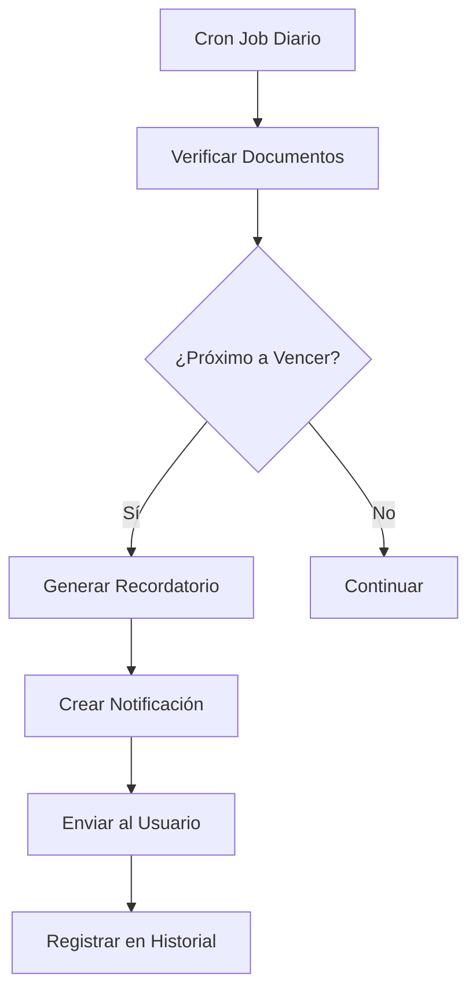
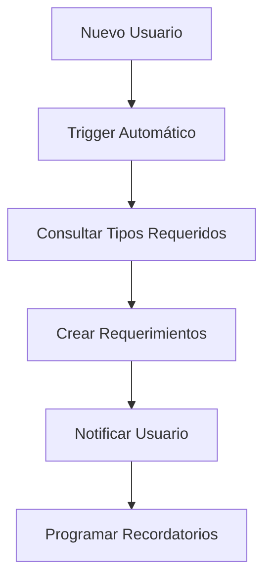

# 📋 Sistema de Gestión Inteligente de Documentos

## 🎯 Descripción General

El Sistema de Gestión Inteligente de Documentos es una solución completa para automatizar el seguimiento, recordatorios y gestión de documentos organizacionales. Diseñado específicamente para el Ministerio de Educación de Guatemala (MINEDUC), pero adaptable a cualquier organización.

## ✨ Características Principales

### 🔔 Notificaciones Inteligentes
- **Recordatorios automáticos** basados en fechas de vencimiento
- **Alertas escaladas** según la proximidad del vencimiento
- **Notificaciones personalizadas** por tipo de documento y departamento
- **Sistema de prioridades** (baja, media, alta, urgente)

### 📅 Gestión de Vencimientos
- **Seguimiento automático** de fechas de expiración
- **Renovaciones programadas** con recordatorios preventivos
- **Estados dinámicos** (pendiente, enviado, aprobado, vencido)
- **Historial completo** de cambios y actualizaciones

### 👥 Gestión por Departamentos
- **Políticas específicas** por área organizacional
- **Tipos de documentos** configurables por rol y departamento
- **Resúmenes departamentales** con métricas de cumplimiento
- **Supervisión centralizada** para administradores

### 📊 Reportes y Estadísticas
- **Dashboard inteligente** con métricas en tiempo real
- **Reportes de cumplimiento** por usuario y departamento
- **Análisis de tendencias** y patrones de entrega
- **Exportación de datos** para análisis externos

## 🏗️ Arquitectura del Sistema

### Backend (Node.js + Express)
```
backend/
├── routes/
│   ├── documentRequirements.js     # API REST para gestión de documentos
│   └── notifications.js           # API de notificaciones
├── services/
│   ├── documentReminderService.js  # Lógica de recordatorios
│   ├── notificationService.js     # Gestión de notificaciones
│   └── cronJobs.js                # Trabajos programados
└── middleware/
    └── auth.js                    # Autenticación JWT
```

### Frontend (React + Tailwind CSS)
```
src/
├── components/
│   ├── DocumentRequirements.jsx      # Vista principal de usuario
│   ├── DocumentRequirementsAdmin.jsx # Panel administrativo
│   ├── SmartNotificationsWidget.jsx  # Widget de notificaciones
│   └── NotificationBell.jsx         # Campanita de notificaciones
├── pages/
│   └── DocumentRequirements.jsx     # Página completa del sistema
└── lib/
    └── api.js                       # Cliente API
```

### Base de Datos (PostgreSQL + Supabase)
```
database/
├── document_requirements_schema.sql   # Esquema principal
├── document_requirements_functions.sql # Funciones SQL
└── seed.sql                          # Datos de prueba
```

## 🗄️ Estructura de la Base de Datos

### Tablas Principales

#### `document_types`
Tipos de documentos requeridos en la organización.
- Configuración de validez y recordatorios
- Aplicabilidad por roles y departamentos
- Estados activo/inactivo

#### `user_document_requirements`
Documentos específicos requeridos para cada usuario.
- Estados: pendiente, enviado, aprobado, rechazado, vencido
- Fechas de entrega, aprobación y vencimiento
- Seguimiento de recordatorios enviados

#### `document_reminders`
Historial de recordatorios enviados.
- Tipos: inicial, advertencia, urgente, vencido, renovación
- Vinculación con notificaciones generadas

#### `department_document_policies`
Políticas específicas por departamento.
- Anula configuraciones globales cuando es necesario
- Flexibilidad para diferentes áreas organizacionales

### Vistas Útiles

#### `documents_expiring_soon`
```sql
-- Documentos próximos a vencer con niveles de urgencia
SELECT user_id, document_type_name, expiration_date, 
       urgency_level, days_until_expiration
FROM documents_expiring_soon
WHERE urgency_level IN ('urgent', 'warning');
```

#### `user_pending_documents`
```sql
-- Documentos pendientes de entrega por usuario
SELECT user_id, document_type_name, required_date,
       priority_level, days_until_due
FROM user_pending_documents
WHERE priority_level IN ('overdue', 'urgent');
```

## 🔧 Configuración e Instalación

### 1. Requisitos Previos
- Node.js 18+
- PostgreSQL 14+
- Cuenta de Supabase (recomendado)

### 2. Configuración de Base de Datos
```bash
# Ejecutar en Supabase SQL Editor o PostgreSQL
psql -d tu_base_de_datos -f database/document_requirements_schema.sql
psql -d tu_base_de_datos -f database/document_requirements_functions.sql
```

### 3. Variables de Entorno

#### Backend (.env)
```env
SUPABASE_URL=tu_supabase_url
SUPABASE_ANON_KEY=tu_supabase_anon_key
SUPABASE_SERVICE_ROLE_KEY=tu_supabase_service_key
JWT_SECRET=tu_jwt_secret
ENABLE_CRON_JOBS=true  # Para habilitar trabajos programados
```

#### Frontend (.env)
```env
VITE_SUPABASE_URL=tu_supabase_url
VITE_SUPABASE_ANON_KEY=tu_supabase_anon_key
VITE_API_BASE_URL=http://localhost:5000
```

### 4. Instalación de Dependencias
```bash
# Backend
cd backend
npm install node-cron  # Para trabajos programados

# Frontend
cd ../
npm install  # Las dependencias ya están en package.json
```

### 5. Configuración de Trabajos Programados

#### Habilitar Cron Jobs en el Servidor
```javascript
// En backend/server.js, agregar:
const cronJobManager = require('./services/cronJobs');

// Inicializar trabajos programados
cronJobManager.initializeJobs();
cronJobManager.startAllJobs();
```

#### Horarios de Ejecución
- **Recordatorios**: Diario a las 9:00 AM
- **Limpieza**: Domingos a las 2:00 AM  
- **Reportes**: Lunes a las 8:00 AM
- **Mantenimiento**: Diario a las 3:00 AM

## 🚀 Uso del Sistema

### Para Usuarios Regulares

#### 1. Vista de Mis Documentos
- Acceder a `/documents/requirements`
- Ver estado de todos los documentos asignados
- Recibir notificaciones automáticas de vencimientos

#### 2. Gestión de Documentos Pendientes
```javascript
// Ejemplo de uso del componente
<DocumentRequirements />
```
- Filtrar por estado, tipo o prioridad
- Subir documentos directamente desde la interfaz
- Seguimiento de fechas de vencimiento

#### 3. Notificaciones Inteligentes
```javascript
// Widget de notificaciones para dashboard
<SmartNotificationsWidget onNavigate={handleNavigation} />
```
- Alertas personalizadas según el perfil del usuario
- Recordatorios escalados por proximidad de vencimiento
- Acciones rápidas desde las notificaciones

### Para Administradores

#### 1. Gestión de Tipos de Documentos
```javascript
// Crear nuevo tipo de documento
await documentRequirementsAPI.createDocumentType({
  name: "Certificado de Antecedentes",
  validity_period_months: 12,
  reminder_before_days: 30,
  required_for_roles: ["admin", "editor"]
});
```

#### 2. Supervisión Departamental
- Vista consolidada de cumplimiento por área
- Identificación de usuarios con documentos vencidos
- Reportes de tendencias y patrones

#### 3. Configuración de Políticas
```javascript
// Política específica para un departamento
await documentRequirementsAPI.createDepartmentPolicy({
  department: "Recursos Humanos",
  document_type_id: "uuid-del-tipo",
  validity_period_months: 6  // Diferente al global
});
```

## 🔄 Flujos de Trabajo

### Flujo de Recordatorios Automáticos



### Flujo de Asignación de Documentos



## 🎨 Componentes de UI

### SmartNotificationsWidget
Widget inteligente que muestra:
- Alertas críticas (documentos vencidos)
- Recordatorios próximos
- Resumen de cumplimiento
- Acciones rápidas

### DocumentRequirements
Componente principal con:
- Vista de documentos por tabs (pendientes, vencidos, completados)
- Filtros avanzados
- Subida de archivos
- Estados visuales intuitivos

### DocumentRequirementsAdmin
Panel administrativo con:
- Gestión de tipos de documentos
- Supervisión departamental
- Reportes y estadísticas
- Configuración de políticas

## 📊 Métricas y KPIs

### Métricas de Usuario
- **Cumplimiento Personal**: % de documentos al día
- **Documentos Pendientes**: Cantidad y urgencia
- **Tiempo Promedio**: Días para completar documentos

### Métricas Departamentales
- **Tasa de Cumplimiento**: % por departamento
- **Documentos Críticos**: Vencidos por área
- **Eficiencia**: Tiempo promedio de completado

### Métricas Organizacionales
- **Cumplimiento Global**: % total de la organización
- **Tendencias**: Evolución mensual/trimestral
- **Riesgos**: Usuarios con múltiples documentos vencidos

## 🔐 Seguridad y Permisos

### Niveles de Acceso
- **Viewer**: Solo sus propios documentos
- **Editor**: Sus documentos + supervisión limitada
- **Admin**: Acceso completo + configuración

### Políticas de Datos
- RLS (Row Level Security) en Supabase
- Autenticación JWT obligatoria
- Auditoría completa de acciones

## 🧪 Testing y Desarrollo

### Ejecutar Trabajos Programados Manualmente
```javascript
// Para testing en desarrollo
const cronJobManager = require('./services/cronJobs');

// Ejecutar trabajo específico
await cronJobManager.runJobManually('document_reminders');
```

### Datos de Prueba
```sql
-- Insertar tipos de documentos de ejemplo
INSERT INTO document_types (name, validity_period_months, reminder_before_days)
VALUES ('Certificado Médico', 12, 30);
```

## 📈 Roadmap y Mejoras Futuras

### Corto Plazo
- [ ] Integración con sistema de archivos existente
- [ ] Templates de documentos descargables
- [ ] Exportación de reportes en PDF/Excel

### Mediano Plazo
- [ ] Integración con Active Directory
- [ ] Firma digital de documentos
- [ ] Workflow de aprobaciones multinivel

### Largo Plazo
- [ ] IA para categorización automática
- [ ] Reconocimiento automático de fechas en documentos
- [ ] Predicción de cumplimiento

## 🆘 Soporte y Documentación

### Logs del Sistema
Los trabajos programados generan logs detallados:
```
🔄 Iniciando procesamiento diario de recordatorios...
📢 3 notificaciones creadas en lote
✅ Recordatorios procesados exitosamente
```

### Troubleshooting Común
1. **Recordatorios no se envían**: Verificar configuración de cron jobs
2. **Notificaciones duplicadas**: Revisar lógica de `shouldSendReminder`
3. **Documentos no se marcan como vencidos**: Ejecutar mantenimiento diario

### Contacto
Para soporte técnico o consultas sobre implementación, contactar al equipo de desarrollo.

---

*Sistema desarrollado con ❤️ para la automatización y eficiencia organizacional*